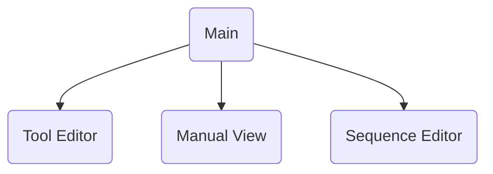

# Control Structure
A device has IO, this can be one or many digital/analog input or outputs.  A device also has a (controller thing? sequencer?).  You can also define variables for a device (bool or float).  These can be read only or can be set by manual control or a recipe.

## Example - Simple Valve
A simple case is a valve that only has a D-Out associated to it.  It's data structure will have a DigitalOutputNode that represents the actual IO and there'll also be a BoolVarNode that's what we're setting it to.  Only the sequencer has access to write to the HAL Streamer or read from the HAL Sampler.  If we want to manually open/close the valve or have a recipe do as such then we'll set it's BoolVarNode.

The device also needs a Sequence that represents this logic.


## Example - 2min Light
This device is a light that is controlled from a digital output.  We want a button that lets you manually turn it on, and after 2min it'll automatically turn off.

The setup is the same as the Simple valve but we'll add in a FloatVarNode that will store the 2min timeout.  The sequence then will be comparing the on time vs that floatVarNode and once it hits 2 min it'll turn it back off.


#Components



#ToDo
* I have some fancy traceback thing in the calibration table tests, not sure if I was planning on using that everywhere or something.

* Should some of these properties be QVariants instead of ints?
  ```
  @QtCore.pyqtProperty(QtCore.QVariant)
    def val(self):
  ```
